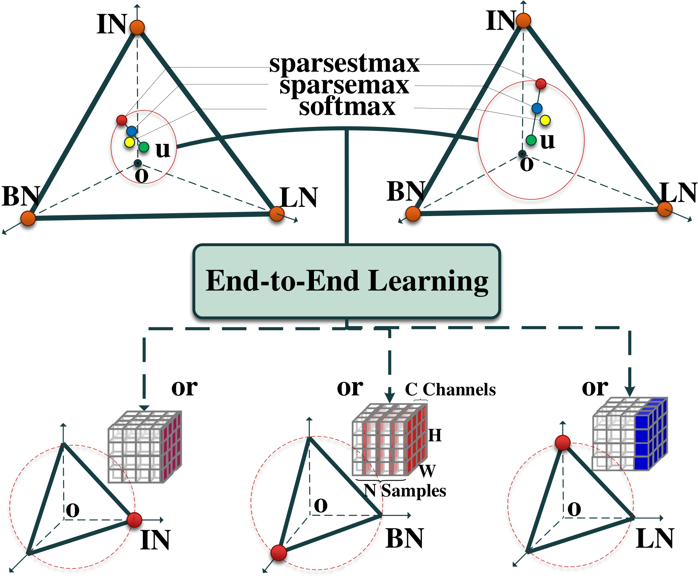

# Sparse Switchable Normalization In Image Classification

This is the PyTorch implementation of the paper **SSN: 
Learning Sparse Switchable Normalization via SparsestMax**, CVPR 2019.

By Wenqi Shao, Tianjian Meng, Jingyu Li, Ruimao Zhang, Yudian Li, 
Xiaogang Wang, Ping Luo.

[Paper-arxiv](https://arxiv.org/abs/1903.03793v1)

## Sparse Switchable Normalization
Sparse Switchable Normalization is able to learn only one normalization operation for each normalization layer in a 
deep neural network in an end-to-end manner.
<div align=center></div>

**Comparisons of top-1 accuracies** on the validation set of ImageNet, by using ResNet50 trained with SN, BN, 
and GN in different batch size settings. The bracket (·, ·) denotes (#GPUs,#samples per GPU). In the bottom part, 
“GN-BN” indicates the difference between the accuracies of GN and BN.


| Normalizer | (8,32) | (8,16) | (8,8) | (8,4) | (8,2) |    
| :----:  | :--: | :--:  | :--:  | :--:  | :--:  |  
| BN | 76.4 | 76.3 | 75.5 | 72.7 | 65.3 |    
| GN | 75.9 | 75.8 | 76.0 | 75.8 | <strong>75.9</strong> |   
| SN | 76.9 | 76.7 | 76.7 | 75.9 | 75.6 |   
| SSN | <strong>77.2</strong> | <strong>77.0</strong> | <strong>76.8</strong> | <strong>76.1</strong>| <strong>75.9</strong> |   


## Getting Started
* Install [PyTorch](http://pytorch.org/)
* Clone the repo:
  ```
  git clone https://github.com/switchablenorms/Sparse_SwitchNorm.git
  ```

### Requirements
- python packages
  - pytorch>=0.4.0
  - torchvision>=0.2.1
  - tensorboardX
  - pyyaml

### Data Preparation
- Download the ImageNet dataset and put them into the `{repo_root}/imagenet/data/imagenet`.

### Training a model from scratch
This part will be released later.

### Evaluating performance of a model
Download the pretrained models from Model Zoo and put them into the `{repo_root}/model_zoo`
```
./test.sh
```

Or you can specify the checkpoint path by modifying test.sh
```
--checkpoint_path model_zoo/ssn_8x2_75.848.pth \
```

## Model Zoo

We provide models pretrained with SSN on ImageNet. The configuration of SN is denoted as (#GPUs, #images per GPU).

| Model | Top-1<sup>*</sup> | Top-5<sup>*</sup> | Download | MD5 |  
| :----:  | :--: | :--:  | :--:  | :--:  |  
|ResNet50v1+SSN (8,32) | 77.25% | 93.29% |[[Google Drive]](https://drive.google.com/open?id=1b7tezVjfSl1MZNHRC8qkaw59lLW4EYEh)  [[Baidu Pan (pin:ckd2)]](https://pan.baidu.com/s/1pjhl57-uhcGj1o-S77SGHw)|5c9fb111577b040e62461db51ffce69b|  
|ResNet50v1+SSN (8,16) | 76.98% | 93.29% |[[Google Drive]](https://drive.google.com/open?id=1wJx_6bNrv7N9zdy1m2vkABTwMuowluxV)  [[Baidu Pan (pin:995u)]](https://pan.baidu.com/s/1CPLelAIKkRS65yRWqVc-_Q)|d7085632529a9b1945a28a4d3bf4cacb|  
|ResNet50v1+SSN (8,8)  | 76.75% | 93.33% |[[Google Drive]](https://drive.google.com/open?id=18HXLmZVB5JF_TcneEMHXtCo1RQt17fYC)  [[Baidu Pan (pin:k9ay)]](https://pan.baidu.com/s/1xur_fRDKNIUCLrw8g1N4kg)|af85a39920644421fc48e216aba6ff0e|  
|ResNet50v1+SSN (8,4)  | 76.07% | 96.71% |[[Google Drive]](https://drive.google.com/open?id=1Ry4kjLURixg2_pzj6J1lwGg1USnSC0oz)  [[Baidu Pan (pin:jpvu)]](https://pan.baidu.com/s/1hA55h7IHoPovQmhwtDLR4A)|949d4bd54a7c63a3371b941eb4d3ea69|  
|ResNet50v1+SSN (8,2)  | 75.85% | 92.73% |[[Google Drive]](https://drive.google.com/open?id=1r485fLeSAwS5zKrxcAtGxa_mPr1lWcoS)  [[Baidu Pan (pin:pdyx)]](https://pan.baidu.com/s/1lzdmVtVGTjWIymdYve6X_A)|dadb0f1a0c49c31aedd6cb83d4996a03|  


*single-crop validation accuracy on ImageNet (a 224x224 center crop from resized image with shorter side=256)

In evaluation, download the above models and put them into the `{repo_root}/model_zoo`.


## Citation
If you find this work helpful in your project or use our model zoo, please consider citing:
```
@inproceedings{shao2018ssn, 
title={SSN: Learning Sparse Switchable Normalization via SparsestMax}, 
author={Shao, Wenqi and Meng, Tianjian and Li Jingyu and Zhang Ruimao and
Li Yudian and Wang, Xiaogang and Luo, Ping}, 
booktitle={CVPR}, 
year={2019} 
}
```
